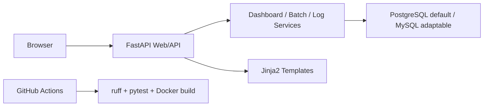
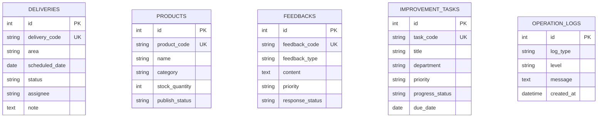
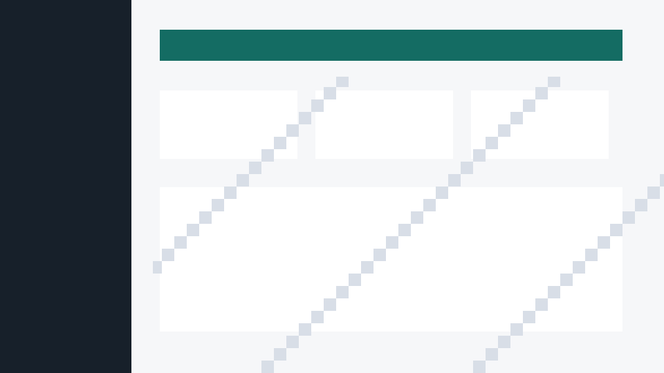
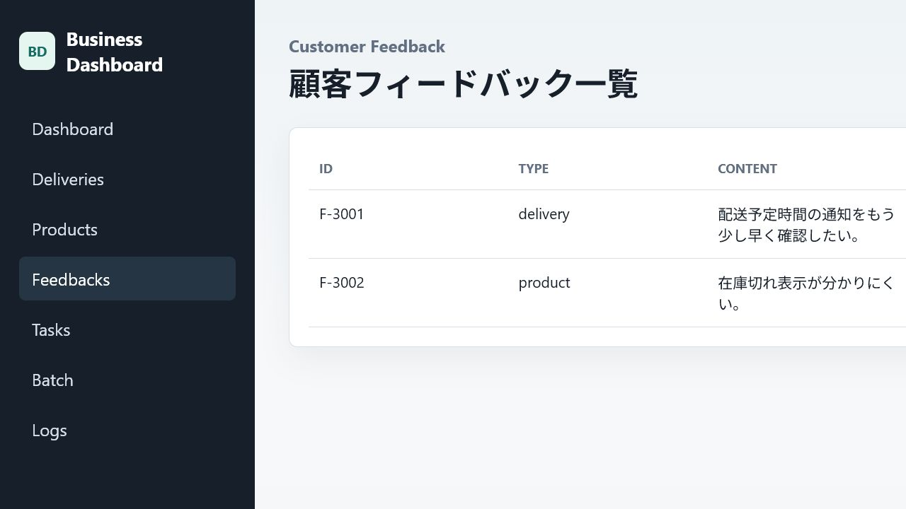
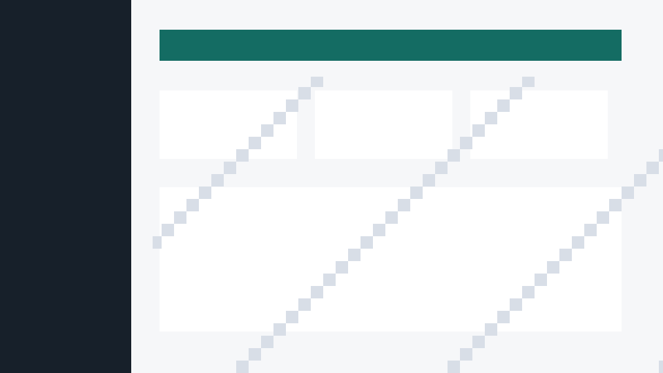
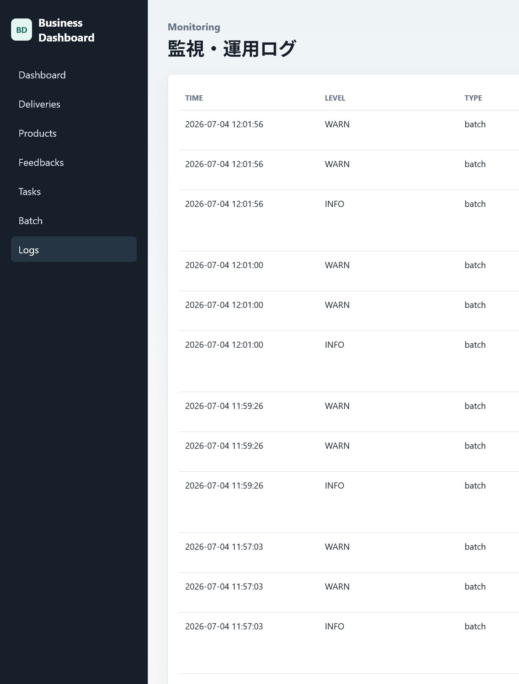

# Sample Business Dashboard

社内業務改善・宅配データ管理ダッシュボードの portfolio sample です。配送データ、商品データ、顧客フィードバック、業務改善タスク、バッチ実行結果、運用ログを管理・可視化する Web アプリケーションとして実装しています。

このリポジトリは技術力説明用の sample であり、実在する会社名、サービス名、顧客名、機関名、機密情報、実業務データは含みません。AWS、CI/CD、DB、Docker は案件関連技術方向を示すための構成例です。

## 対応技術スタック

案件で明示された技術:

- Python によるサーバーサイド開発
- AWS を想定したインフラ設計
- GitHub / GitHub Actions による CI/CD
- Git ベースのソース管理
- PostgreSQL / MySQL を想定した DB 設計
- Docker によるローカル開発環境
- 要求分析、仕様策定、機能設計、保守、運用
- 社内業務改善、宅配・流通データ管理、業務自動化

sample 完整性のために追加した技術:

- FastAPI
- Jinja2 + simple JavaScript
- SQLAlchemy
- pytest
- ruff / mypy
- Playwright screenshot script

## システム構成



## 主な機能

- ダッシュボード KPI: 本日注文数、配送予定件数、問い合わせ件数、改善タスク件数、低在庫アラート
- 配送データ管理: 配送 ID、エリア、予定日、ステータス、担当者、備考
- 商品データ管理: 商品 ID、商品名、カテゴリ、在庫数、公開ステータス
- 顧客フィードバック管理: 種別、内容、優先度、対応ステータス
- 業務改善タスク管理: タイトル、担当部署、優先度、進捗、期限
- バッチ処理: 遅延配送、低在庫、高優先度フィードバック、期限超過タスクを集計
- 保守運用: health check、application log、batch log、logs page、error handling

## ディレクトリ構成

```text
sample-business-dashboard/
├── app/                  # FastAPI app, routers, services, DB models, templates
├── tests/                # pytest and Playwright screenshot spec
├── docs/                 # architecture, technical design, setup
├── infra/                # PostgreSQL init and AWS sample config
├── screenshots/          # README screenshot placeholders
├── .github/workflows/    # GitHub Actions CI
├── Dockerfile
├── docker-compose.yml
├── pyproject.toml
└── README.md
```

詳細は [docs/project-structure.md](docs/project-structure.md) を参照してください。

## ローカル実行

```bash
python -m venv .venv
source .venv/bin/activate
pip install --upgrade pip
pip install ".[dev]"
uvicorn app.main:app --reload
```

Windows PowerShell:

```powershell
python -m venv .venv
.\.venv\Scripts\Activate.ps1
pip install --upgrade pip
pip install ".[dev]"
uvicorn app.main:app --reload
```

起動後に `http://localhost:8000` を開きます。

## Docker 実行

```bash
docker compose up --build
```

- App: `http://localhost:8000`
- Adminer: `http://localhost:8080`
- PostgreSQL: `localhost:5432`

`.env.example` は sample 設定です。実 secret は `.env` に置き、Git にコミットしません。

## API

- `GET /api/health`
- `GET /api/dashboard`
- `GET /api/deliveries`, `POST /api/deliveries`
- `GET /api/products`, `POST /api/products`
- `GET /api/feedbacks`, `POST /api/feedbacks`
- `GET /api/improvement-tasks`, `POST /api/improvement-tasks`
- `POST /api/batch/run`
- `GET /api/logs`

## DB 設計



デフォルト Docker DB は PostgreSQL です。MySQL に切り替える場合は MySQL driver を追加し、`DATABASE_URL` を `mysql+pymysql://user:password@db:3306/database` 形式へ変更します。

## テスト

```bash
pytest
ruff check .
```

GitHub Actions は `.github/workflows/ci.yml` で checkout、Python setup、dependency install、lint、unit test、Docker image build を実行します。

## AWS 想定

`infra/aws/` に sample CloudFormation skeleton を用意しています。想定構成は ALB、ECS Fargate または App Runner、RDS PostgreSQL、S3、CloudWatch、Secrets Manager です。実 AWS アカウントや key は不要です。

詳細は [docs/architecture.md](docs/architecture.md) と [infra/aws/README.md](infra/aws/README.md) を参照してください。

Terraform 版 sample は [infra/aws/terraform/](infra/aws/terraform/) にあります。Frontend は S3 + CloudFront、Backend は ECS Fargate + ALB、さらに VPC/subnet/gateway、security group、IAM、CloudWatch、Lambda、SQS、EventBridge、GitHub Actions OIDC deploy role を含みます。

## セキュリティ考慮

- real secret をコミットしない
- `.env.example` のみを共有し、`.env` は `.gitignore` で除外
- DB 接続情報は環境変数で管理
- Pydantic による入力値検証
- 重複登録などは業務エラーとして制御
- 想定外エラーは内部詳細をレスポンスに出さない
- AWS key を hard code しない

## スクリーンショット

README 掲載用の placeholder を `screenshots/` に配置しています。実画面で更新する場合:

```bash
docker compose up --build
npm init -y
npm i -D @playwright/test
npx playwright install chromium
npx playwright test
```

参照画像:







## 今後の拡張方向

- 認証 / 認可、部署別 RBAC
- Alembic による migration 管理
- CSV import/export
- 構造化 JSON logging と CloudWatch metrics
- Terraform 版 AWS sample
- OpenAPI client generation
- Playwright E2E の CI 組み込み
