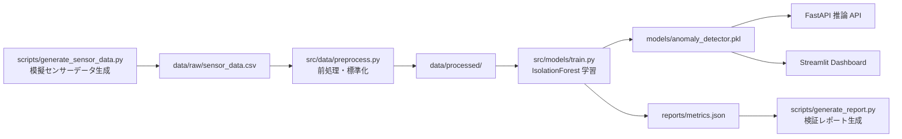
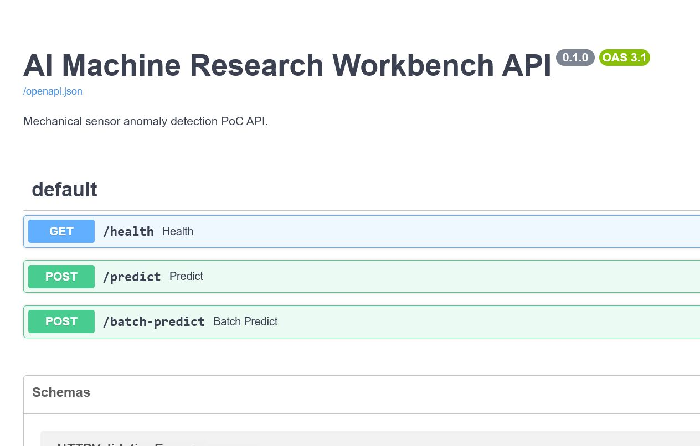
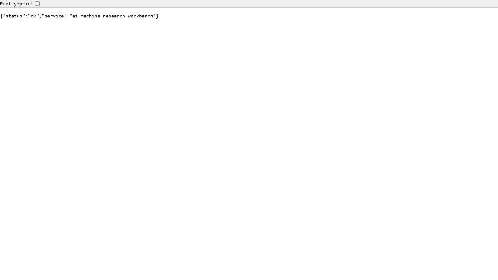
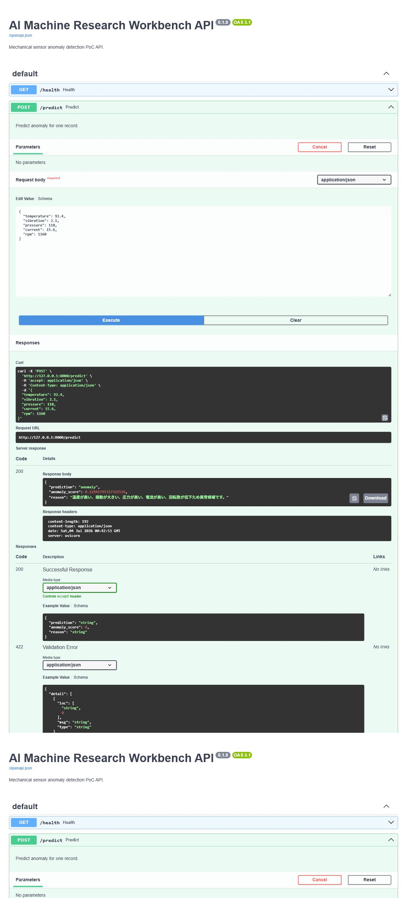
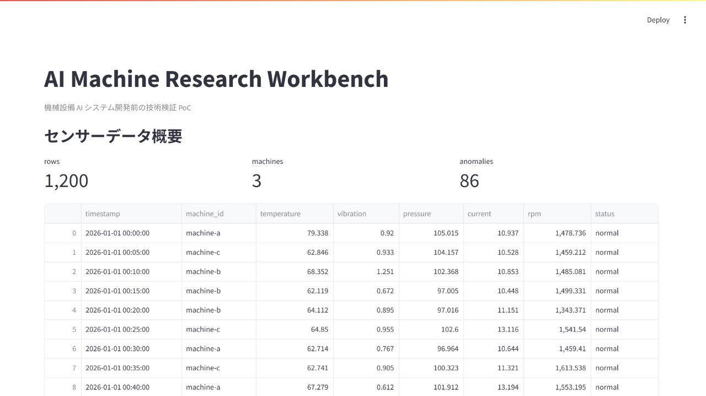
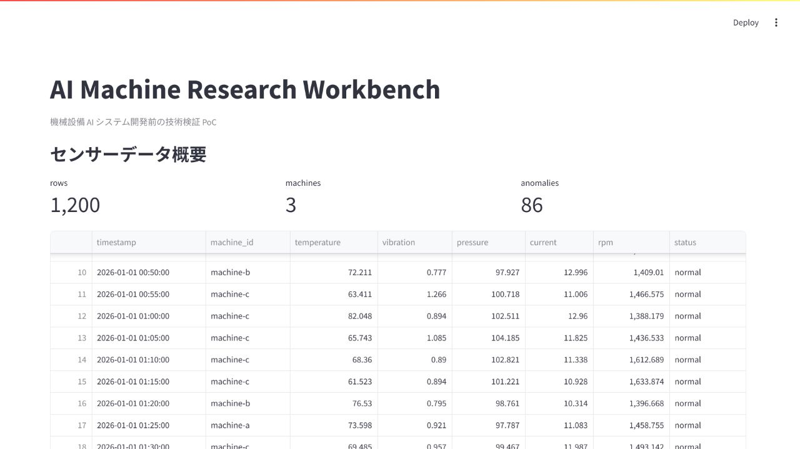

# ai-machine-research-workbench

## プロジェクト概要

`ai-machine-research-workbench` は、機械設備向け AI システム開発前の技術検証 PoC です。  
温度、振動、圧力、電流、回転数などの模擬センサーデータを生成し、Python と scikit-learn による異常検知、FastAPI による推論 API、Streamlit による検証 Dashboard、Markdown による技術検証レポート作成までを一通り確認できます。

本プロジェクトは、研究開発機関における「AI システム開発 / リサーチエンジニア」業務を想定し、Linux 環境構築、AI 技術検証、PoC 実装、検証資料作成の流れを展示する sample です。

## 想定業務との関連性

- Python を用いたデータ処理、モデル学習、推論処理の実装
- Linux / Ubuntu 環境での開発、実行、Docker 化
- AI 技術導入前のアルゴリズム選定、評価、課題整理
- FastAPI による AI 推論 API のプロトタイプ構築
- Streamlit による研究・検証用 Dashboard 作成
- Markdown による技術調査メモ、検証計画、検証レポート整理

## 技術スタック

- Python 3.11+
- FastAPI / Uvicorn
- scikit-learn
- pandas / numpy
- matplotlib
- Streamlit
- pytest
- Docker / Docker Compose
- Makefile
- GitHub Actions
- YAML 設定ファイル
- logging

## システム構成図



## ディレクトリ構成

```text
.
├── app/
├── config/
├── data/
│   ├── processed/
│   └── raw/
├── docs/
├── models/
├── reports/
│   └── figures/
├── scripts/
├── src/
│   ├── api/
│   ├── data/
│   └── models/
├── tests/
├── .github/workflows/
├── Dockerfile
├── docker-compose.yml
├── Makefile
└── requirements.txt
```

## Linux 環境でのセットアップ手順

```bash
sudo apt update
sudo apt install -y python3.11 python3.11-venv make
python3.11 -m venv .venv
source .venv/bin/activate
pip install --upgrade pip
pip install -r requirements.txt
```

または Makefile を利用します。

```bash
make setup
```

## Docker Compose での起動方法

```bash
make docker-up
```

FastAPI:

```text
http://localhost:8000/docs
```

Streamlit Dashboard:

```text
http://localhost:8501
```

停止:

```bash
make docker-down
```

## データ生成方法

```bash
make generate-data
```

出力先:

```text
data/raw/sensor_data.csv
```

## モデル学習方法

```bash
make train
```

出力:

- `models/anomaly_detector.pkl`
- `reports/metrics.json`
- `reports/figures/sensor_trends.png`
- `reports/figures/anomaly_scatter.png`

## API 起動方法

```bash
make api
```

推論 API 例:

```bash
curl -X POST http://localhost:8000/predict \
  -H "Content-Type: application/json" \
  -d '{"temperature":75.0,"vibration":1.2,"pressure":101.0,"current":12.0,"rpm":1500}'
```

## Streamlit Dashboard 起動方法

```bash
make dashboard
```

Dashboard では、センサーデータの推移、異常点、評価結果、CSV アップロードによる異常検知を確認できます。

## テスト実行方法

```bash
make test
```

## 検証レポート生成方法

```bash
make report
```

出力先:

```text
reports/ai_validation_report.md
```

## 実行画面イメージ

### 1. FastAPI Swagger UI



### 2. Health Check Endpoint



### 3. Predict API 実行結果



### 4. Streamlit Dashboard 概要



### 5. Streamlit Dashboard グラフ表示



## 今後の改善案

- 実機データを利用した閾値設計と評価
- 時系列モデルによる故障予兆検知
- MLflow などによる実験管理
- API 認証、監視、モデルバージョン管理
- Docker Compose から Kubernetes への移行検討
- 現場ヒアリング結果を反映した異常理由説明ロジックの改善
