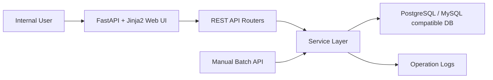
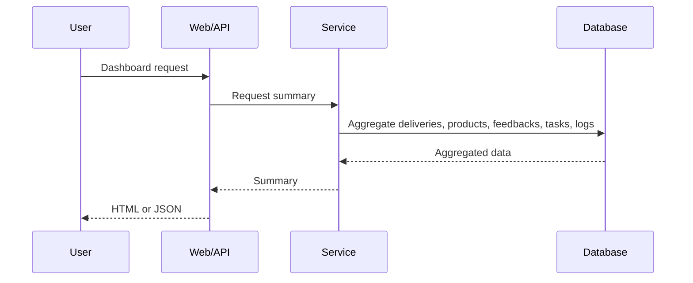
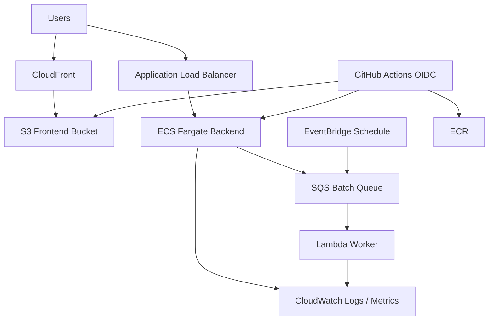

# Architecture

This project is a portfolio sample. It does not include real company names, real customer names, real public-sector names, confidential information, or production business data.

## Local Application Architecture

## Components

- Web UI: dashboard, deliveries, products, feedbacks, improvement tasks, batch, and logs pages.
- REST API: JSON endpoints under `/api/*` for system integration and testing.
- Service Layer: dashboard aggregation, batch processing, and operation logging.
- DB: SQLAlchemy models designed for PostgreSQL by default and MySQL adaptation by connection URL/driver change.
- Batch: manually triggered daily business automation sample.

## API Flow

## Terraform AWS Sample

`infra/aws/terraform/` provides a fuller AWS sample architecture for portfolio demonstration.

## AWS Design Coverage

- Frontend: S3 private bucket and CloudFront Origin Access Control.
- Backend: ECS Fargate service behind an Application Load Balancer.
- Network: VPC, public/private subnets, Internet Gateway, NAT Gateway, route tables.
- Security: security groups, S3 public access block, HTTPS redirect, IAM roles and policies.
- Operations: CloudWatch log groups, metrics dashboard, and alarms.
- Async processing: SQS queue and dead-letter queue.
- Scheduling: EventBridge rule for daily batch events.
- Serverless helper: Lambda worker connected to SQS.
- CI/CD: GitHub Actions OIDC role, ECR push, S3 sync, CloudFront invalidation, ECS deployment sample.

## Authentication and Authorization

The local sample does not implement user authentication. In a real environment, add OIDC/SSO, RBAC, audit logging, and least-privilege IAM. The Terraform sample includes infrastructure-level authorization examples such as GitHub OIDC, ECS task roles, Lambda roles, and S3 bucket policies.

## Operations

The application includes health check, application logs, batch logs, and operational logs page. The AWS sample extends this with CloudWatch log groups, alarms, and a dashboard. A production system should also include WAF, backup, incident runbooks, structured logs, and secret rotation.
