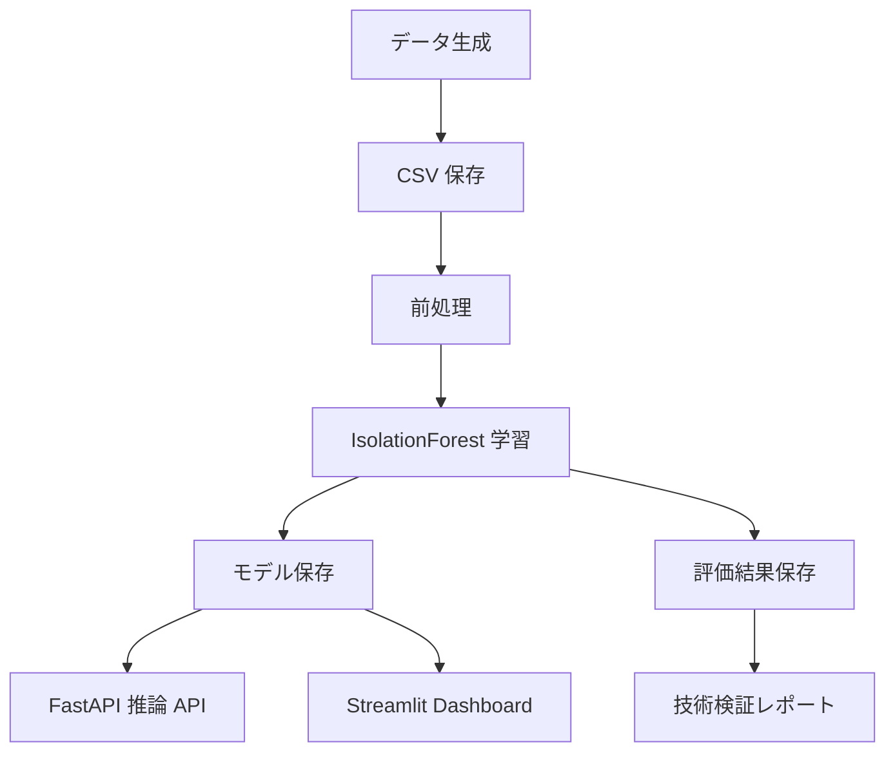

# システムアーキテクチャ

## 目的

本システムは、機械設備 AI システム開発前の技術検証 PoC として、模擬センサーデータ生成、前処理、異常検知モデル学習、推論 API、Dashboard、検証レポート作成を一連の流れで確認する。

## 構成

## コンポーネント

- `scripts/generate_sensor_data.py`: 模擬機械センサーデータを生成する。
- `src/data/preprocess.py`: 欠損値補完、標準化、特徴量選択を行う。
- `src/models/train.py`: IsolationForest を学習し、モデルと評価結果を保存する。
- `src/models/predict.py`: 単件・一括推論を提供する。
- `src/api/main.py`: FastAPI による推論 API を提供する。
- `app/streamlit_app.py`: 技術検証 Dashboard を提供する。

## 設計方針

PoC 段階では、シンプルな構成で再現性と説明性を優先する。設定値は `config/config.yaml` に集約し、Linux / Docker 環境で同じ手順を実行できるようにする。
