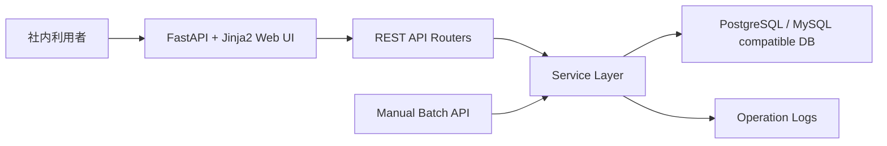
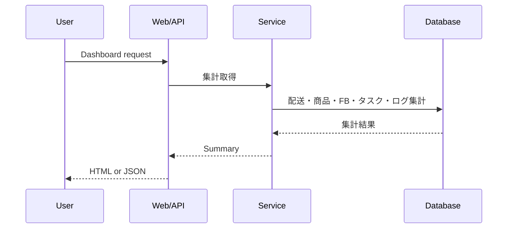
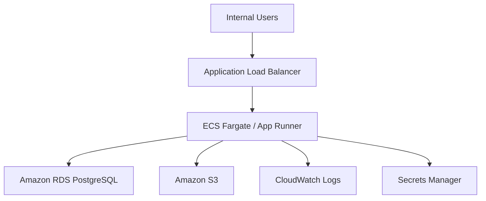

# Architecture

本プロジェクトは portfolio sample であり、実在する会社名・顧客名・機関名・機密情報・実業務データを含みません。

## システム構成図

## コンポーネント説明

- Web UI: ダッシュボード、配送、商品、フィードバック、改善タスク、バッチ、ログ画面を表示します。
- REST API: `/api/*` の JSON API を提供し、画面以外の連携にも使える構成にしています。
- Service Layer: 集計、バッチ、ログ記録などの業務ロジックを router から分離します。
- DB: SQLAlchemy により PostgreSQL を標準、MySQL も接続 URL 変更で想定できます。
- Batch: API から手動実行できる日次処理サンプルです。

## データフロー

## API 流れ

入力値は Pydantic schema で検証し、重複登録などの業務エラーは `BusinessRuleError` で統一的に処理します。想定外エラーはログに残し、レスポンスでは内部詳細を返しません。

## AWS 配置想定

AWS 部分は sample config です。実 AWS アカウントや認証情報は不要です。

## 認証流程

この sample では実装を簡略化し、認証は未実装です。実案件では OIDC / SSO、RBAC、監査ログを追加する想定です。

## 保守・運用の考え方

ヘルスチェック、アプリケーションログ、バッチログ、業務エラー処理を最小構成として実装しています。実運用では CloudWatch メトリクス、アラーム、構造化ログ、バックアップ、障害時 runbook を追加します。
