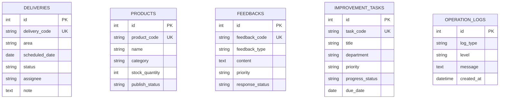

# Technical Design

## 技術説明

- Python / FastAPI: API と画面の両方を軽量に実装します。
- Jinja2: サーバーサイドレンダリングで運用画面を素早く構築します。
- SQLAlchemy: PostgreSQL / MySQL を抽象化する ORM として利用します。
- pytest: API の基本挙動、バッチ、エラー処理を検証します。
- Docker: app、db、Adminer をローカルで再現します。
- GitHub Actions: lint、unit test、Docker build を自動実行します。

FastAPI、SQLAlchemy、pytest は sample 完整性のために追加した技術であり、案件で明示された技術ではありません。

## 主要モジュール

- `app/main.py`: アプリ生成、router 登録、起動時初期化。
- `app/db/models.py`: DB テーブル定義。
- `app/db/schemas.py`: API 入出力スキーマと入力検証。
- `app/routers/`: REST API と HTML 画面の入口。
- `app/services/`: 集計、バッチ、ログなどの業務ロジック。
- `tests/`: API と業務ロジックの regression test。

## DB 設計

## API 設計

- `GET /api/health`
- `GET /api/dashboard`
- `GET /api/deliveries`, `POST /api/deliveries`
- `GET /api/products`, `POST /api/products`
- `GET /api/feedbacks`, `POST /api/feedbacks`
- `GET /api/improvement-tasks`, `POST /api/improvement-tasks`
- `POST /api/batch/run`
- `GET /api/logs`

## エラー処理

入力形式エラーは FastAPI/Pydantic の 422 を利用します。重複コードなどの業務エラーは 409 などの明示的なステータスで返します。想定外エラーはログへ記録し、レスポンスに内部詳細を出しません。

## ログ設計

標準出力ログは Docker / CloudWatch Logs を想定します。加えて `operation_logs` テーブルへアプリケーション、バッチ、警告ログを保存し、画面で確認できます。

## テスト設計

pytest で health、dashboard、delivery CRUD、batch、error handling を検証します。CI では ruff と pytest と Docker build を実行します。

## バッチ処理設計

日次処理として、配送遅延、低在庫、高優先度フィードバック、期限超過タスクを集計します。結果は API response と operation log の両方に残します。

## セキュリティ設計

`.env.example` のみをコミットし、実 secret は `.gitignore` で除外します。DB URL は環境変数管理です。AWS key は配置せず、sample CloudFormation も secret を自動生成する例にしています。
